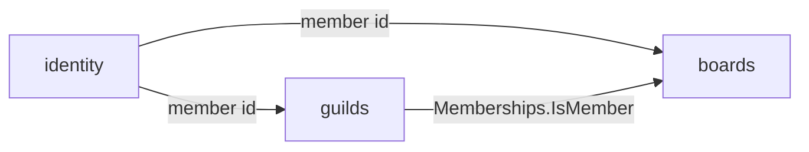

# Context map

The bounded contexts in this project, which unit hosts each one, and how they
depend on each other.

## Contexts

| Context | Subdomain | Hosted in | Owns |
| ------- | --------- | --------- | ---- |
| [boards](contexts/boards/README.md) | core | `services/api` (`contexts/boards`) | boards, tasks |
| [guilds](contexts/guilds/README.md) | supporting | `services/api` (`contexts/guilds`) | guilds, memberships |
| [identity](contexts/identity/README.md) | generic | `services/api` (`contexts/identity`) | members, credentials, tokens |

`apps/desktop` hosts no context: it is a client of the API and holds no domain
data of its own.

- **Core:** where the project competes. Gets the most care and the richest model.
- **Supporting:** needed and specific to this project, but not the differentiator.
- **Generic:** solved problems (auth, billing, email). Prefer buying or reusing
  over building.

## Relationships

One row per dependency. Upstream is the side whose model the other has to
adapt to.

| Upstream | Downstream | Pattern | Through |
| -------- | ---------- | ------- | ------- |
| identity | guilds | customer/supplier | The authenticated member id (`identity.MemberID(ctx)`) and a lookup of a member id by email, translated into a plain member id inside guilds |
| identity | boards | customer/supplier | The authenticated member id (`identity.MemberID(ctx)`) |
| guilds | boards | customer/supplier | The `guilds.Memberships` Go interface: `IsMember(ctx, guildID, memberID) (bool, error)`. Boards never read the guild tables. |

Patterns: *customer/supplier*, *conformist*, *anticorruption layer*,
*open host service* / *published language*, *shared kernel*, *separate ways*.
A shared kernel is a deliberate exception and needs a line saying why.

"Through" names the contract: an API, a set of domain events, a module
interface. Never another context's tables or internal types.

## Diagram

Optional. Keep it in sync with the tables above, or leave it out.

