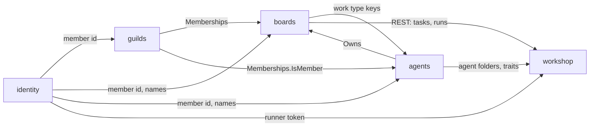

# Context map

The bounded contexts in this project, which unit hosts each one, and how they
depend on each other.

## Contexts

| Context | Subdomain | Hosted in | Owns |
| ------- | --------- | --------- | ---- |
| [boards](contexts/boards/README.md) | core | `services/api` (`contexts/boards`) | boards and their columns, tasks and subtasks, comments, activity, work types, board events and presence |
| [agents](contexts/agents/README.md) | supporting | `services/api` (`contexts/agents`); mirrored as folders by `apps/desktop` | agents, their skillsets and work priorities, shares |
| [guilds](contexts/guilds/README.md) | supporting | `services/api` (`contexts/guilds`) | guilds, memberships, invites |
| [workshop](contexts/workshop/README.md) | supporting | `apps/desktop` (`internal/workshop`), per machine | board configs, worktrees, running Claude CLI for a run |
| [moderation](contexts/moderation/README.md) | supporting | `services/api` (`contexts/moderation`); used by `apps/console` | operators, sanctions, reports, the audit log |
| [identity](contexts/identity/README.md) | generic | `services/api` (`contexts/identity`) | members, credentials, tokens, personal tokens, web sessions, handoff codes |

`services/api` also hosts the **MCP server** (module `mcp/`): an *open host
service* over guilds, boards and agents for Claude and other MCP clients. It has no
domain of its own; each MCP tool calls a use case those contexts publish, with
the same rules as REST.

`apps/web` hosts no context: it is a client of the API. `apps/desktop` is a
client of the API too and holds no guild, board or agent data of its own (its
agent folders are a synced copy of the member's agents), but it hosts the
**workshop**, which only exists on a member's machine.

- **Core:** where the project competes. Gets the most care and the richest model.
- **Supporting:** needed and specific to this project, but not the differentiator.
- **Generic:** solved problems (auth, billing, email). Prefer buying or reusing
  over building.

## Relationships

One row per dependency. Upstream is the side whose model the other has to
adapt to.

| Upstream | Downstream | Pattern | Through |
| -------- | ---------- | ------- | ------- |
| identity | guilds | customer/supplier | The authenticated member id (`identity.MemberID(ctx)`) and a lookup of a member id by email, translated into a plain member id inside guilds |
| identity | boards | customer/supplier | The authenticated member id (`identity.MemberID(ctx)`) and display names by id (`identity.DisplayNames`) |
| identity | agents | customer/supplier | The authenticated member id and display names by id, as for boards |
| guilds | boards | customer/supplier | The `guilds.Memberships` Go interface: `IsMember(ctx, guildID, memberID)` and `IsArchived(ctx, guildID)`. Boards never read the guild tables. |
| guilds | agents | customer/supplier | `guilds.Memberships.IsMember`, to check sharing, listing a guild's agents and recruiting. Agents never read the guild tables. |
| agents | boards | customer/supplier | `agents.Owns(ctx, memberID, agentID)`, behind a boards port, so a claim is only ever for an agent of the claiming member. Boards never read agents' tables. |
| boards | agents | published language | Work type keys (`coding`, `research`, …) as plain strings in an agent's work priorities. Agents never read boards' tables, and a key a guild lacks just counts as off. |
| boards | workshop | customer/supplier | The REST API: tasks with subtasks and comments, columns, runs (start, finish), comments and moves. Translated into the workshop's `RunSpec`. |
| agents | workshop | customer/supplier | The member's synced agent folders (`agent.toml`, `skills/`) and `GET /api/agent-traits` for the trait instructions |
| identity | workshop | customer/supplier | A personal token the desktop makes for the runner (`POST /api/tokens`) |
| identity | moderation | customer/supplier | Member lookups by id and email, and a member search, for the console |
| guilds | moderation | customer/supplier | Guild lookups by id and a guild search with member counts, for the console |
| moderation | identity, guilds | open host service | `ActiveFor`, a sanction check moderation's wiring sets into identity (members) and guilds (guilds); an `Audit` recorder behind a one-method port in each context that records |
| boards | moderation | customer/supplier | `CloseStreamsOf(member or guild)` to end a sanctioned target's live board streams, and `BoardCount` for the console's guild record |
| guilds, boards, agents | MCP server (`mcp/`) | open host service | The contexts' published Go functions (the same use cases REST calls); identity's `VerifyPersonalToken` for sign-in |

Patterns: *customer/supplier*, *conformist*, *anticorruption layer*,
*open host service* / *published language*, *shared kernel*, *separate ways*.
A shared kernel is a deliberate exception and needs a line saying why.

"Through" names the contract: an API, a set of domain events, a module
interface. Never another context's tables or internal types.

## Diagram

Optional. Keep it in sync with the tables above, or leave it out.

